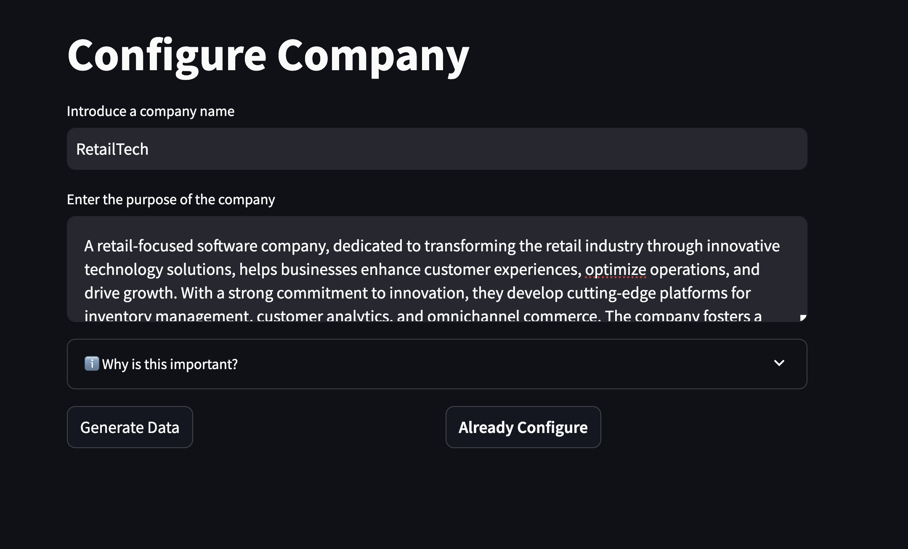
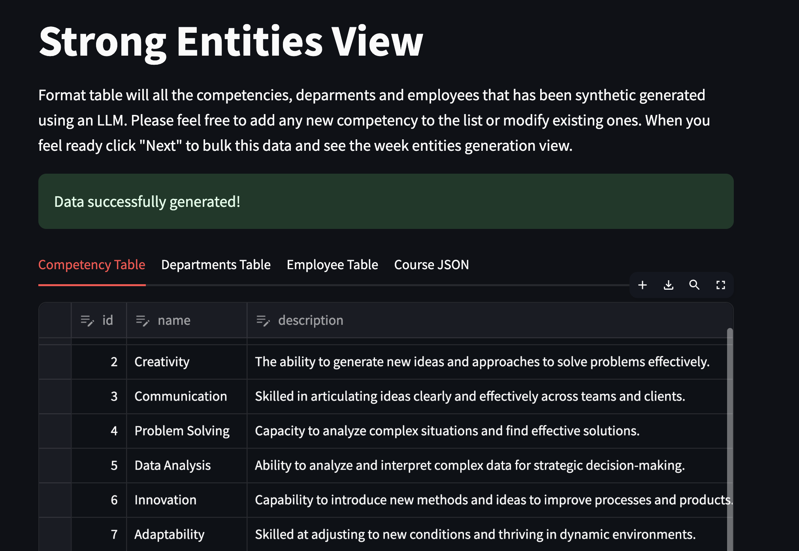
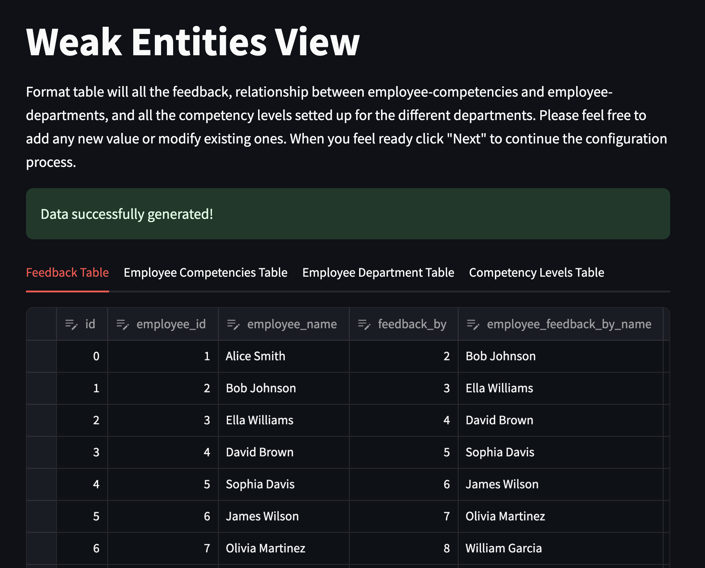
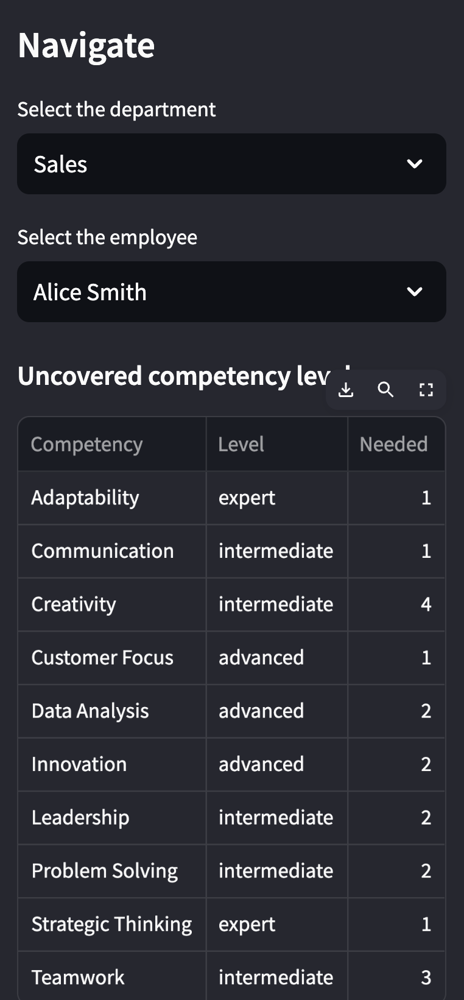
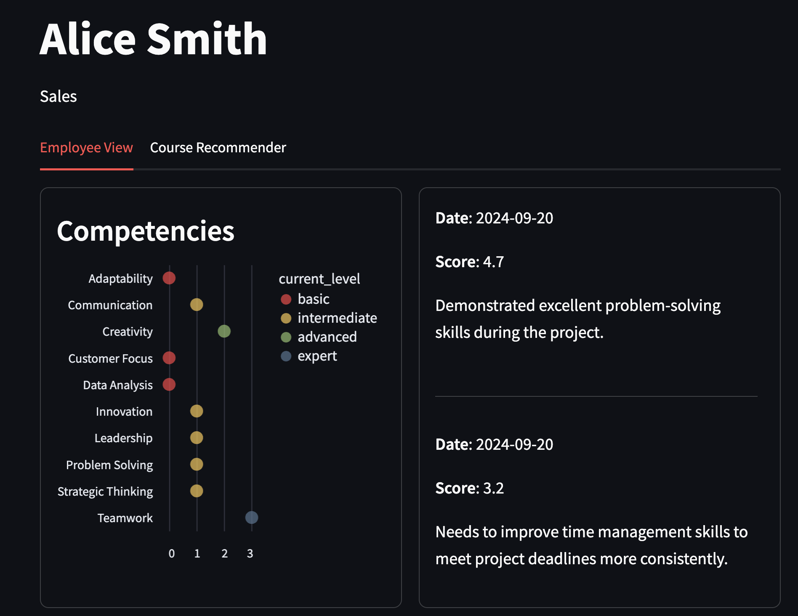
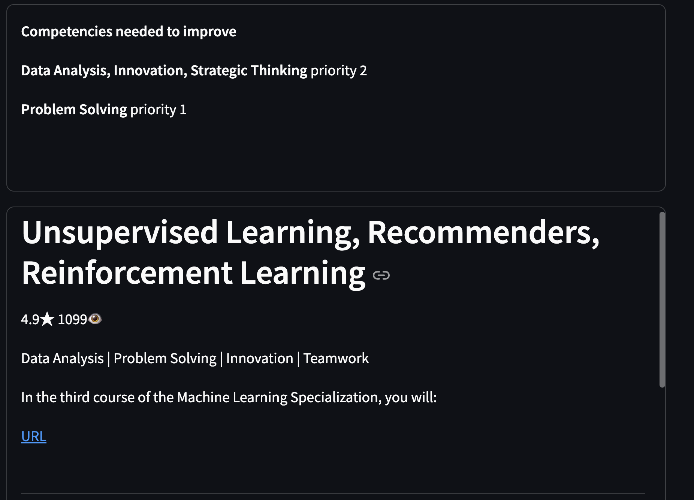

# Application

The application is configured in four different transition views:

1. [**Configure company**](#configure-company)
2. [**Strong Entities**](#strong-entities)
3. [**Weak Entities**](#weak-entities)
4. [**Manger**](#manager)

## Configure company

The first step in the configuration process involves setting up your company. This is a mandatory step before proceeding to the next part of the configuration. You will need to provide the following two key attributes:

- **Company Name**: The name of the company being configured.
- **Company Description**: A detailed description of the company. The more complete and specific the description, the better the synthetic data generation for competencies will be.
These two attributes are essential for generating synthetic data related to company competencies.

### Steps:
1. Fill in the Company Name and Company Description fields.
2. Once ready, click the "Generate Data" button. The system will take a few seconds to process and load the data for the next configuration step.

>> **NOTE**: If you have already completed the company configuration, click the **"Already Configured"** button to skip this step and proceed directly to the employee part.

## Strong Entities

The **Strong Entities View** presents a detailed overview of competencies, departments, and employees that have been synthetically generated using an LLM (Large Language Model). This view allows you to review, modify, and add new data entries before proceeding to the next step of data processing.

### Components of the View

- **Competency Table**: Displays the list of competencies that have been generated, including fields such as ID, name, and description. You can modify existing competencies or add new ones as needed.

- **Departments Table**: Lists all the departments generated by the system. You can add, edit, or review department entries to ensure they align with your organizational structure.

- **Employee Table**: Contains data related to employees, including the roles and departments they are assigned to. This table is also editable, allowing you to fine-tune the generated employee data.

- **Course JSON**: Displays the raw course data in JSON format. The data in this section is not editable.

### Actions

1. **Review and Edit**: Review the generated competency, department, and employee data. If needed, make edits directly within the tables by clicking the corresponding cells.

2. **Add/Delete Entries**: You are free to add/delete competencies, departments, or employees. For example, if your organization has unique competencies that were not generated, you can manually input them in the Competency Table.

3. **Bulk Data Generation**: Once you are satisfied with the data, click the "Next" button to proceed to bulk ingestion. This will generate the data for the next step, ensuring that all entities are ready for the following process.

## Weak Entities

The Weak Entities View provides a detailed table of feedback, relationships between employee competencies and departments, and competency levels for different departments. This view allows you to review, modify, and add new entries to ensure all weak entities are properly configured before continuing the configuration process.

### Components of the View

- **Feedback Table**: Displays feedback given between employees. It includes fields such as employee_id, employee_name, feedback_by, and employee_feedback_by_name. You can modify existing feedback entries or add new ones.

- **Employee Competencies Table**: Lists the relationship between employees and their competencies. This table allows you to add or edit the employee competencies as required.

- **Employee Department Table**: Contains the relationship between employees and their respective departments. You can review, edit, or add new department assignments for employees to ensure that the correct structure is reflected.

- **Competency Levels Tabl**e: Displays the competency levels set for each department. You can adjust these levels or add new competencies as needed to reflect the organization’s goals.

The actions are the same as in the previous [point](#actions)

## Manager

Once the data has been added and configured, the application is ready to begin. This application provides a simplified version of the **Manager View**, designed to recommend courses for employees.

The view is divided into three sections:

- [Department Panal](#department-panel)
- [Employee View](#employee-view)

### Department Panel

The **Department Panel** consists three key components:

1. **Department Selection**: A dropdown list showing all the departments in the organization. Select the department you want to manage.
2. **Employee Selection**: A dropdown list showing all the employees in the selected department. Select the employee for whom you want to recommend courses.
3. **Uncovered Competencies Table**: A table listing the competencies that have not been fully met by the selected department. It includes the following columns:
   - **Competency**: The specific competency required.
   - **Level**: The proficiency level needed (intermediate, advanced, expert).
   - **Needed**: The number of employees needed to meet the required competency level.

### Employee View

The Employee View consists of two main sections that provide detailed information about the employee and their recommended courses. This view is split into two tabs:

#### Employee Information Tab

This tab displays key data related to the employee:

- **Competency Levels (Left Side)**: A graphical representation of the employee's competency levels. Each competency is shown with its current level, ranging from basic to expert.

- **Feedback (Right Side)**: Displays the feedback the employee has received, including:
  - The date of feedback.
  - A numerical score representing performance.
  - Comments detailing the feedback, highlighting strengths and areas for improvement.

#### Course Recommendation Tab

This tab is divided into two sections that focus on improving the employee's competencies through recommended courses:

1. **Competencies to Improve**:Lists the competencies that the employee needs to improve, based on feedback and performance data. Competencies are displayed with a priority level, helping to guide the most critical areas of improvement.
2. **Course Recommendations**: A list of recommended courses tailored to the employee, sorted by relevance to their competency gaps. Each course includes the following information:
- **Title**: The name of the course.
- **Rating & Views**: The average course rating and the number of views or enrollments.
- **Associated Competencies**: The competencies from the company’s list that are matched with the course.
- **Course Descriptio**n: A short description summarizing the course content.
- **Link**: A clickable URL to access the course.

