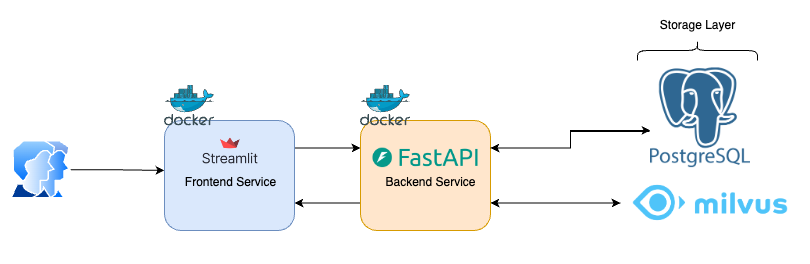

# Architecture

One of the core premises of the entire architecture is that, wherever possible, every component will be implemented using Python.

The system architecture will rely upon the following components:
- **Frontend service**: This service will handle interaction with the user, loading all necessary configurations and delivering data to the client through communication with the backend service.
- **Backend service**, This service will communicate with the data storage systems to retrieve and serve data to the **frontend service**. Additionally, it will manage all the business logic required for the recommendation system.
- **PostgreSQL**: A PostgreSQL database will be responsible for storing all structured data.
- **Milvus**: The Milvus vector database will store all course-related information and perform similarity searches to power the recommendation system.

## Architecture/Diagram

The diagram illustrates the architecture of the system, breaking down its components and their interactions:

- **Frontend Service** (Streamlit): The frontend service, implemented using Streamlit, is responsible for interacting with the user. It runs within a Docker container and communicates with the backend service to fetch and display data.

- **Backend Service** (FastAPI): The backend service, built using FastAPI, also operates within a Docker container. It is responsible for processing requests from the frontend and interacting with the storage layer to retrieve or store data. The business logic, including recommendation algorithms, resides here.

## Technical Decision

### PostgreSQL

PostgreSQL is a powerful, open-source object-relational database management system (ORDBMS) known for its reliability, data integrity, and extensive feature set. It can be easily integrated with every service and can handle complex queries. Moreover, it supports JSON data in case it is needed to handle these without using NoSQL databases.

The decision to use PostgreSQL was based on the need for a robust database capable of handling relational data, with quick integration across all services. Its advanced features and scalability make it a perfect choice for this system.

### Milvus

Milvus is a cutting-edge, open-source vector database designed specifically for similarity search and AI applications. It stands out in its ability to handle large-scale vector data.

Milvus is an excellent choice for vector similarity search tasks. It offers simple configuration options, including Docker Compose and a local system setup called "Milvus Lite," which provides an easy and efficient way to deploy and use the database.

### FastAPI

FastAPI is a modern, high-performance web framework for building APIs with Python. It stands out due to its speed, asynchronous capabilities, and automatic generation of interactive API documentation using OpenAPI and JSON Schema.

FastAPI provides all the tools necessary for building fast, lightweight APIs without being overly complex. It uses Pydantic for data validation, which is crucial for ensuring data integrity and consistency throughout the project.

### Streamlit

Streamlit is an open-source framework designed to make it easy to create and share custom web applications for machine learning and data science. It offers a simple, intuitive way to rapidly build data-driven applications, making it ideal for this project.

## Technical Debt

- **Scalability and performance with Streamlit**: Streamlit is primarily designed for rapid prototyping and small to medium-scale applications. This is not scalable for production applications.
- **Monolithic structure**: Currently, the backend service operates as a monothilic combining all business logic and data manipulation. Over time, this could make the backend service harder to maintain and scale as more features are added. Breaking down the backend into microservices or serverless functions will allow better maintainability and scalability.
- **Data Storage Layer**: It is important to verify whether the current data storage layer (PostgreSQL and Milvus) can scale effectively as the amount of data grows. If not properly optimized, this could lead to bottlenecks and performance degradation.
- **Cache Layer**: The absence of a cache layer means all requests are being processed in real-time, which could lead to performance issues as the system scales.