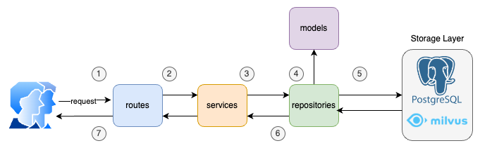

# Backend Service

The backend service is structured using a Domain-Driven Design (DDD) approach. This design emphasizes a clear separation of concerns, ensuring that each layer has distinct responsibilities. Below are the different layers that make up the architecture:

- **Routes (Presentation Layer)**:
This layer corresponds to the FastAPI routes where user or client requests are received. It acts as the entry point for incoming HTTP requests and forwards them to the service layer.

- **Service Layer (Business Logic)**:
This layer handles the core business logic of your application. It processes the requests from the routes, performs necessary validations or computations, and interacts with the repository layer to fetch or manipulate data. The service layer ensures that the business rules and workflows are maintained and acts as the primary decision-maker.

- **Repository Layer (Data Access Layer)**:
The repository layer is responsible for interacting with the database or any external data source. It follows the Repository Pattern, which abstracts the data access logic, allowing the service layer to focus on business logic without being concerned with how data is retrieved or stored.

- **Models (Data Models/Domain Layer)**:
The models layer represents the structure of your data (tables and relationships in the database). These models define how data is stored and manipulated but don't contain any business logic.

## Architecture/Diagram

The system works as follows:

1. **(1) (2) (3)** The client/user makes an HTTP request, which is routed to the corresponding service. This service may interact with *1..N* repositories to retrieve the necessary information needed to perform its business logic.
2. **(4) (5)** The repositories use the defined models to interact with the corresponding storage layer and retrieve the required data.
3. **(6) (7)** The service will apply the business logic to the data and send it back to the route that will be in charge of dispatching the data or information to the client/user.

## Software patterns

Mostly has been used two software patterns:
- **Service pattern** Encapsulates and manages all business logic, acting as an intermediary between the presentation layer (e.g., routes) and the data access layer (repositories).
- **Repository pattern** Used to abstract the logic required to interact with the different data sources. It provides a layer between the data access layer and the business logic, allowing the application to work with a consistent, domain-specific interface, regardless of how data is stored or retrieved.

## Technical Debt

- **Lack of Global Services and Repositories**: Adding new repositories or services is challenging due to the absence of a global service layer that defines common CRUD operations. Each service and repository must be individually created and maintained, leading to potential code duplication and inefficiency.
- **Inadequate Error Handling**: The system lacks proper error tracking and handling mechanisms. Errors such as data insertion failures or duplicate key violations are not properly logged or managed, making it difficult to debug and ensure data integrity.
- **Missing User Authentication and Token Management**: There is no user authentication system in place, and token management is missing. This leaves the system vulnerable, as there's no way to authenticate users or secure API access.