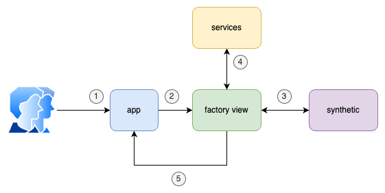

# Frontend Service

The backend service is trying to use a Domain-Driven Design (DDD) approach. Below are the different layers that make up the architecture:

- **App Layer (Factory Layer)**: Acts as the controller of the frontend system. It uses a Factory Pattern to decide which view to display based on the current state of the application.

- **Services Layer (Data Handling/Communication Layer)**: Responsible for handling the external communication with the backend service. It ensures that the UI Layer is provided with the necessary data to be displayed.
  
- **Synthetic Data Layer**:  This layer handles the generation of synthetic data within the application.

- **UI Layer (Views/Presentation Layer)**: The UI (views) layer is responsible for:
  - Rendering the application’s interface and managing user interactions.
  - Display data fetched by the service or synthetic layer.
  - Updating the state to swithc between differents views.

## Architecture/Diagram

The system works as folows:

- **(1) (2)**, The client/user interacts with the app layer, which uses the **Factory Pattern** to load the appropriate view based on the current state.

- **(3)** (optional), If necessary, the view will generate synthetic data, which can then be ingested into the database systems. The view will also present this data to the user, allowing for modifications if needed.
- **(4)**, The **services layer** is responsible for two main functions: sending data to the backend for ingestion, or providing the necessary data to the view to display to the user.
- **(5)**, When the user changes the state (e.g., by clicking a button), the system will reload and present the next view, continuing the iteration.

## Technical Debt

The current design of the UI Layer introduces significant technical debt due to its violation of the Single Responsibility Principle (SRP), one of the key tenets of clean architecture and maintainable code. The UI layer is handling multiple responsibilities, such as data presentation, managing user interactions, generating synthetic data, and handling state changes.

To address this, the responsibilities should be refactored into more distinct layers or components. For example, integrating the data synthetic generation in the backend service and serve it to the view part through the services without having any data manipulation.