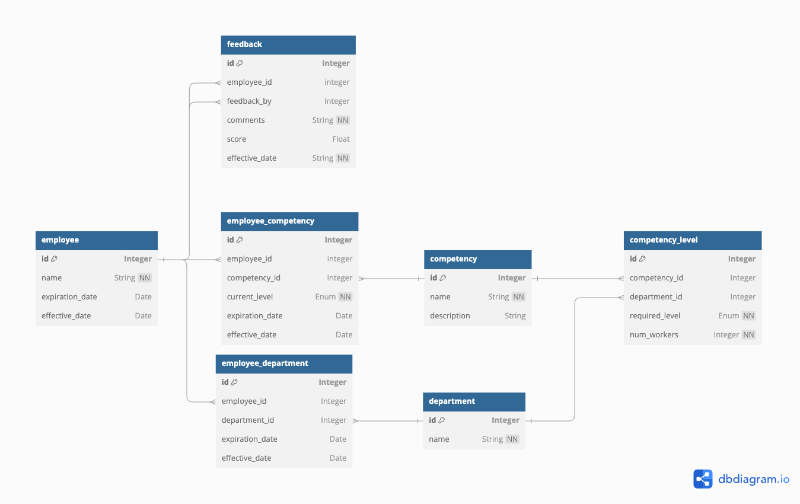

# Data Model

Several assumptions have been made in designing the data model:

- **Feedback**: Feedback is provided by employees in the form of comments and optional scores.
- **Competency Levels**: Competency levels are established at the department level. For example, the Sales department may require 2 employees with "Leadership" at an advanced level, and 1 employee with "Communication" at an expert level.
- **Levels**: The different levels associated with a competency are going to be: basic, intermediate, advanced, and expert.
  
The idea is to set up a quick data model that could fulfill the requirements without too much troubleshooting.

## Diagram

## Tables

  
Employee Table

| Name            | Type    | Key     | Description                                               | Example         |
|-----------------|---------|---------|-----------------------------------------------------------|-----------------|
| id              | Integer | PK      | Primary key, a unique identifier for each employee.          | 1               |
| name            | String  |         | Name of the employee.                                      | 'John Doe'      |
| expiration_date | Date    |         | Expiration date of the employee's role.                    | '2024-12-31'    |
| effective_date  | Date    | Default | The effective date of the employee's role.                 | CURRENT_DATE()  |

  
Feedback Table

| Name            | Type    | Key     | Description                                                  | Example                        |
|-----------------|---------|---------|--------------------------------------------------------------|--------------------------------|
| id              | Integer | PK      | Primary key, a unique identifier for each feedback entry.       | 1                              |
| employee_id     | Integer | FK      | Foreign key referencing the employee receiving feedback.      | 1                              |
| feedback_by     | Integer | FK      | Foreign key referencing the employee providing feedback.      | 2                              |
| comments        | String  |         | Comments provided as feedback.                                | 'Great work on the project!'   |
| score           | Float   |         | An Optional score is given in the feedback.                         | 4.5                            |
| effective_date  | String  |         | Date when the feedback was given.                             | '2024-09-30'                   |

  
Department Table

| Name            | Type    | Key     | Description                                               | Example          |
|-----------------|---------|---------|-----------------------------------------------------------|------------------|
| id              | Integer | PK      | Primary key, a unique identifier for each department.        | 1                |
| name            | String  |         | Name of the department.                                    | 'HR Department'  |

  
Competency

| Name         | Type    | Key     | Description                                           | Example                |
|--------------|---------|---------|-------------------------------------------------------|------------------------|
| id           | Integer | PK      | Primary key, a unique identifier for each competency.   | 1                      |
| name         | String  |         | Name of the competency.                               | 'Python Programming'   |
| description  | String  |         | Description of the competency.                        | 'Programming language competency.' |

  
Employee Competency Table

| Name            | Type    | Key     | Description                                                   | Example         |
|-----------------|---------|---------|---------------------------------------------------------------|-----------------|
| id              | Integer | PK      | Primary key, a unique identifier for each employee competency.   | 1               |
| employee_id     | Integer | FK      | Foreign key referencing the associated employee.               | 1               |
| competency_id   | Integer | FK      | Foreign key referencing the associated competency.             | 1               |
| current_level   | Enum    |         | The current level of competency the employee has.              | 'Intermediate'  |
| expiration_date | Date    |         | Expiration date for this competency.                           | '2024-12-31'    |
| effective_date  | Date    | Default | Effective date of the competency.                              | CURRENT_DATE()  |

  
Employee Department Table

| Name            | Type    | Key     | Description                                                   | Example         |
|-----------------|---------|---------|---------------------------------------------------------------|-----------------|
| id              | Integer | PK      | Primary key, a unique identifier for each employee-department relation. | 1               |
| employee_id     | Integer | FK      | Foreign key referencing the associated employee.               | 1               |
| department_id   | Integer | FK      | Foreign key referencing the associated department.             | 1               |
| expiration_date | Date    |         | Expiration date of the employee's assignment to the department.| '2024-12-31'    |
| effective_date  | Date    | Default | Effective date of the assignment.                              | CURRENT_DATE()  |

  
Competency Level Table

| Name            | Type    | Key     | Description                                                   | Example         |
|-----------------|---------|---------|---------------------------------------------------------------|-----------------|
| id              | Integer | PK      | Primary key, a unique identifier for each competency level.      | 1               |
| competency_id   | Integer | FK      | Foreign key referencing the associated competency.             | 1               |
| department_id   | Integer | FK      | Foreign key referencing the associated department.             | 1               |
| required_level  | Enum    |         | Required level for this competency in the department.          | 'Expert'        |
| num_workers     | Integer |         | Number of workers needed with this competency.                 | 5               |

## Technical Debt

- **Static Feedback**: Feedback is limited to just comments and scores. This model does not account for capturing more detailed or dynamic feedback, which may be required in the future to meet additional business needs.

- **Global Competency Limitation**: Competencies are defined globally, but this approach is restrictive. Ideally, competencies should be configurable at different levels, such as global, department, and team levels, to allow for greater flexibility and specificity across various organizational units.

- **Restricted Competency Levels**: Competency levels are currently set at the department level, which is limiting. In practice, competency levels may need to be defined not only at the department level but also globally.

- **Rigid Relationships**: The model enforces a strict relationship where an employee is linked to only one department and competencies are tied to that department. This structure does not accommodate scenarios where employees work across multiple departments or roles, potentially requiring competencies from different areas.

- **Lack of Historical Tracking**: The current model cannot track historical changes in employee competencies, department assignments, or feedback. Without historical data, it will be challenging to measure progress or analyze changes over time, which could limit future insights into employee development and organizational trends.