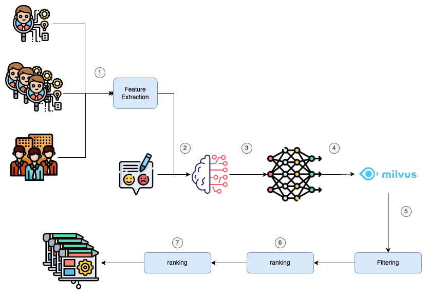

# Recommendation System

As mentioned in the README, the recommendation system will focus on addressing two questions:

1. **Course Recommendation Based on Competency Requirements**
2. **Course Recommendation Based on Feedback**

This system is going to part from a [Cold Start](https://en.wikipedia.org/wiki/Cold_start_(recommender_systems)) point. There is no prior recommendation data.

## Diagram

The workflow of the recommend system goes as follow:

1. **Extract the following competency data**: Competencies associated with the employee. Competencies associated with all employees in the department (real level). The competency level set for the department (expected level). With this data, the following features are going to be extracted:
   1. **Difference Calculation**: Calculate the difference between the expected and real competency levels for each competency. Only competencies where the real level is less than the expected level will be considered.
   2. **Employee Competency Filtering**: Filter competencies based on the employee's current competency level. For example, if the employee has a competency at the intermediate level, only advanced and expert levels of that competency will be applicable.
   3. **Uncovered Competencies**: After applying the filters, identify all the competencies that are not adequately covered by the department but are applicable to the employee, including the number of workers needed to fill the gap.
2. **Competency Priority Extractor**: A new feature will be calculated using a Large Language Model (LLM), based on both the **Feedback** and **Uncovered Competencies**. The feedback and uncovered competencies will be passed to the LLM, which will identify the competencies mentioned in the feedback and prioritize them. The LLM will assign a priority score, ranging up to 3, to each competency based on its relevance to the uncovered competencies. This results in a prioritized list of competencies.
3. **Embedding Model**: These competencies are going to be passed into an embedding model for calculate is vector.
4. **Retrive candidates**: Using the generated vector and applying cosine similarity, a search will be performed in the Milvus database to retrieve the 15 most relevant courses.
   - Cosine similarity measures the cosine of the angle between two vectors, It effectively captures the similarity between competencies and courses making it useful for finding the most relevant mathces.
5. **Filtering**: This part is not implemented but the idea is to filter the courses already done or recommended.
6. **Scoring**: In this step, a **weighted ranking** will be applied to help determine the most relevant courses.
7. **Ranking**: Based on the final score, the courses will be ranked in order of relevance and then presented to the user.

## Weighted Ranking

The final score is calcualted using different different metadata or feature extracted in the different steps of the workflow:

- **coeff_priority (cp)**: In the **Step 2**, all the competencies have been calculated with their corresponding priority. The score is calculated by summing the priority values of all the competencies that are both present in the course's  and listed in the extracted ones. After summing these priorities of the competencies present in both, the result is divided by the total number of competencies in the competencies_priority dictionary. This gives an average priority score based on the competencies that match between the course and the predefined priority list.

$\text{coeff\_priority} = \frac{\sum \left( \text{competencies_priority}\right) \text{for competency in course\_competencies} \text{if competency in competencies\_priority}}{\text{len(competencies\_priority)}}$

- **matching_competencies (mc)**: cosine similarity metric retrieved by Milvus database.
- **matching_skills (ms)**: cosine similarity metric compute againts the Skills metadata of the course.
- **rating (r)**: rating metadata of the course.
- **number_of_viewers (nv)**: number of viewers metadata of the course.

Using all this values a weight ranking has been used to calculated the score:

$final\_score = 0.3*cp + 0.3*mc + 0.2 *ms + 0.1*r + 0.1*nv$

## Technical Dept

- **Complexity of the competency extractor**: It relies heavily on an LLM, normally they can generate great restults, they are often hard to debug, explain, or verify, especially when priorities are being calculated dynamically. One possible solution could be to break down the problem in two queries: the first one focuse on feedback and the second one on the competencies extracted from the department.
- **Filtering step**: As the data model it is not storing any information about the courses done or recommended, this is not implemented yet.
- **Scoring and ranking limitation**: The scoring algorithms applies a static weights ranking. The static weights may not be suitable for all scenarios. For example, some users may prioritize ratings over matching competencies, while others might value popularity (number of viewers).
- **Milvus and cosine similarity**: The index created in Milvus is just one plain but as the dataset start growing, It is going to need a more proper index. Also, cosine similarity works best for mediium datasets but if the dataset grows it may need other technique (approximate nearest neighbors).
- **Visibility of the recommendation**: The algorithm produces a single score but there is no clear mechanism explaining why a courses is recommend. Add all the metrics to the output can give more reliability in the algorithm.